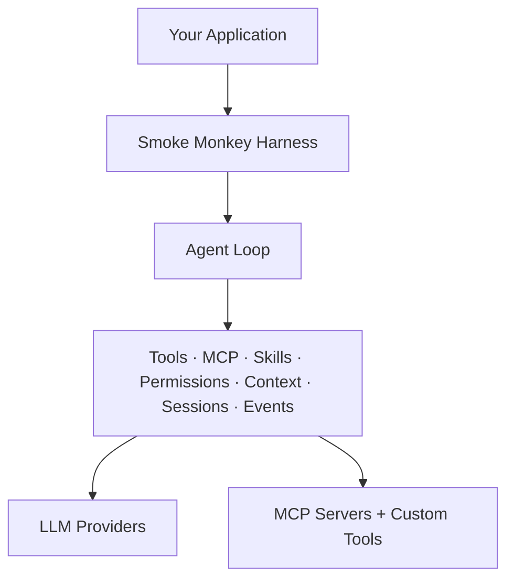

<div align="center">

# Smoke Monkey Harness

**Build production-ready AI agents and coding agents in TypeScript.**

An embeddable, framework-agnostic agent runtime for building **AI coding
assistants, autonomous developer tools, desktop agents, and MCP-powered
applications**.


Smoke Monkey Harness is **not an AI model**. It is the runtime that turns an
LLM into an agent capable of **planning, calling tools, editing files,
interacting with MCP servers, managing context, asking for permission,
recovering from failures, and resuming work**.

**No NestJS. No database. Just the agent runtime.**

[](https://www.npmjs.com/package/smoke-monkey-harness)
[](LICENSE)
[](https://github.com/RajdeepDevelopment/smoke-monkey-harness/actions/workflows/ci.yml)
[](tsconfig.json)

</div>

---

## Why Smoke Monkey?

Building an agent from scratch means implementing the loop, tool execution,
permissions, context management, MCP integration, recovery, sessions, and
provider abstraction yourself. Smoke Monkey provides those primitives out of
the box.

| Capability                    | Smoke Monkey |
| ----------------------------- | ------------ |
| Agent loop                    | ✅            |
| Tool calling                  | ✅            |
| 24 built-in tools             | ✅            |
| MCP                           | ✅            |
| Skills / `SKILL.md`           | ✅            |
| Human-in-the-loop permissions | ✅            |
| Automatic context compaction  | ✅            |
| Resumable sessions            | ✅            |
| Multiple LLM providers        | ✅            |
| Custom tools                  | ✅            |
| Custom storage                | ✅            |
| Framework independent         | ✅            |
| Database required             | ❌            |

---

## Install

```bash
pnpm add smoke-monkey-harness
# or: npm install smoke-monkey-harness
# or: yarn add smoke-monkey-harness
```

**GitHub Packages** (same package, scoped):

```ini
# .npmrc
@rajdeepdevelopment:registry=https://npm.pkg.github.com
//npm.pkg.github.com/:_authToken=GITHUB_PAT
```

```bash
pnpm add @rajdeepdevelopment/smoke-monkey-harness
```

> GitHub Packages requires auth even for public packages — create a
> [fine-grained PAT](https://github.com/settings/tokens?type=beta) with
> `read:packages` permission on this repository.

---

## Quickstart

```ts
import { createAgent } from 'smoke-monkey-harness'

const agent = createAgent({
  provider: 'nvidia',
  model: 'nvidia/nemotron-3-super-120b-a12b',
  apiKey: process.env.NVIDIA_API_KEY, // or pass a resolver: (provider) => key
  workspacePath: process.cwd(),
})

const result = await agent.run(
  'Refactor the auth middleware to use JWTs, then run its tests.',
)
console.log(result.status)
```

That's it. Smoke Monkey handles the agent loop, tool execution, planning,
verification, recovery, and context management — no framework, no database.

### Add human-in-the-loop permissions

Route permission prompts and questions to your UI (or set `autoApprove: true`):

```ts
agent.on('permission.required', (e) => {
  const { toolCallId, toolName } = e.data
  agent.resolvePermission(toolCallId, /* allow | deny */ 'allow')
})

agent.on('ask_user.required', (e) => {
  agent.respond(e.data.toolCallId, await promptUser(e.data.question))
})
```

Any OpenAI-compatible endpoint works — `openrouter`, `gemini`, `xai`, … or run
locally with Ollama:

```ts
const agent = createAgent({ provider: 'ollama', model: 'qwen3:8b', workspacePath: process.cwd() })
```

---

## Core capabilities

**🤖 Agent Runtime**
Multi-step planning through a phase machine
(`explore → plan → edit → verify → recover → complete`), with step /
no-progress / runaway / spin guards, `finish_task` detection, interruption and
resume.

**🛠️ 24 Built-in Tools**
Filesystem, terminal, search, Git, and agent-management tools in five groups.
Disable groups with `tools` or register your own.

| Group      | Tools |
| ---        | --- |
| filesystem | read_file, write_file, edit_file, line_edit, replace_lines, apply_patch, delete_file, list_directory, inspect |
| terminal   | run_command, run_test |
| search     | glob, grep |
| git        | git_status, git_diff, git_log |
| agent      | ask_user, context_manage, todo_write, finish_task, list_skills, use_skill |

**🔌 MCP Native**
Connect local stdio or remote Streamable HTTP MCP servers
(`<server>__<tool>` tool names, lazy connect, close at run end). A curated
stock catalog (`flattenStock` / `stockToMcpConfig`) provisions well-known
servers, and `inspect_mcp_stock` / `request_mcp_approval` recommend + gate
disabled servers behind a user approval pause.

**🧠 Skills**
Claude Code / Codex / AniGravity / opencode-style `SKILL.md` folders, loaded
**just-in-time**: the system prompt carries only a one-line catalog; the model
pulls full instructions with `use_skill` when the task matches — no context
bloat from skills that don't apply. Point anywhere with `skillsDir`, or let it
scan `.opencode/skills`, `.claude/skills`, `.codex/skills` in the workspace and
home dirs.

**🔐 Permissions**
`allow-all` / `deny-all` / `ask-default`, or your own resolver:

```ts
permissions: ({ toolName, args }) => {
  // your policy
  return 'allow' // 'deny' | 'ask'
}
```

**📦 Context Management**
Automatic compaction summarizes the conversation when it crosses the token
budget, so long-running tasks keep going without blowing the context window.

**💾 Resumable Sessions**
Continue work across runs with a persistent `sessionId`:

```ts
const agent = createAgent({ /* ... */, sessionId: 'project-123' })
```

**🌐 Multi-provider LLMs**
`openai`, `openrouter`, `nvidia`, `xai`, `gemini`, `opencode`, `omniroute`,
`ollama` (REST + SSE streaming), or any OpenAI-compatible endpoint via
`baseUrl` override.

---

## Built for

- AI coding assistants
- Autonomous code editors
- Desktop AI applications
- Developer copilots
- MCP-powered agents
- Internal engineering agents
- Agentic automation tools
- Research and experimentation platforms

---

## Architecture



---

## MCP configuration

**Connect your agent to the outside world.** Smoke Monkey supports MCP servers
over stdio and Streamable HTTP. Servers connect lazily and can require explicit
user approval before activation.

```ts
import { createAgent, stockToMcpConfig, findStockEntry } from 'smoke-monkey-harness'

const agent = createAgent({
  provider: 'nvidia',
  model: 'nvidia/nemotron-3-super-120b-a12b',
  apiKey: process.env.NVIDIA_API_KEY,
  workspacePath: process.cwd(),
  mcp: [
    // stdio server:
    {
      id: 'filesystem',
      name: 'filesystem-mcp',
      description: 'Local filesystem tools',
      command: 'npx',
      args: ['-y', '@modelcontextprotocol/server-filesystem', '/tmp'],
      enabled: true,
    },
    // streamable-HTTP server:
    {
      id: 'miro',
      name: 'miro',
      description: 'Miro boards',
      url: 'https://mcp.miro.com/',
      headers: { authorization: 'Bearer ' + process.env.MIRO_TOKEN },
      enabled: false, // disabled servers need user approval before use
    },
    // ...or pull a config from the stock catalog:
    stockToMcpConfig(findStockEntry('playwright-mcp')!),
  ],
})
```

**Supported connection types**

- Local stdio servers
- Remote Streamable HTTP servers
- Authentication headers
- Lazy connection
- Approval gates
- Runtime server management (`addMcpServer` / `removeMcpServer` / `listMcpServers`)
- Stock server catalog

---

## Skills

Reusable instruction bundles in the same `SKILL.md` folder format used by
Claude Code, Codex, AniGravity, and opencode — loaded just-in-time so the
system prompt stays small.

```ts
const agent = createAgent({
  provider: 'nvidia',
  model: 'nvidia/nemotron-3-super-120b-a12b',
  apiKey: process.env.NVIDIA_API_KEY,
  workspacePath: process.cwd(),
  skillsDir: ['examples/skills'], // scans for <dir>/<skill>/SKILL.md + <dir>/<skill>.md
  autoApprove: true,
})
```

```markdown
---
name: Commit Message
description: Write conventional, concise git commit messages for the uncommitted changes.
---
# Conventional Commit Message
…instructions the agent follows while the task matches…
```

Discovery defaults to `.opencode/skills`, `.claude/skills`, `.codex/skills`
under the workspace plus `~/.claude/skills`, `~/.codex/skills`,
`~/.opencode/skills`, `~/.config/opencode/skills`. The tools `list_skills`
(browse catalog) and `use_skill` (load instructions) register automatically
when at least one skill is present. Lower-level pieces: `loadSkillsFromDirs()`,
`defaultSkillDirs()`, and `SkillRegistry` (all exported from the package root).

---

## API

`createAgent(options)` → `AgentHarness`

- `agent.run(task, opts?)` — run the agent to completion, pausing on questions / permission prompts.
- `agent.respond(toolCallId, text)` — answer a pending `ask_user`.
- `agent.resolvePermission(toolCallId, 'allow' | 'deny')` — resolve a `permission.required` pause.
- `agent.resolveMcpDecision(toolCallId, { action: 'enable' | 'add' | 'skip', names })` — resolve an `mcp.approval_required` pause.
- `agent.addMcpServer(config)` / `agent.removeMcpServer(id)` / `agent.listMcpServers()` — manage MCP servers at runtime.
- `agent.skills` — the live `SkillRegistry` (`.all()`, `.get(id)`, `.count`).
- `agent.abort()` — stop the current run.
- `agent.on(type, cb)` / `agent.onAny(cb)` — subscribe to events.
- `agent.events` / `agent.store` — the raw emitter and store, for advanced wiring.

**Events:** `run.started`, `step.started/ended`, `tool.started/output/progress/completed/failed`,
`text.delta/thought/end`, `phase.changed`, `agent.state`, `context.updated`,
`ask_user.required`, `permission.required`, `mcp.approval_required`,
`mcp.resolved`, `compaction.started/completed`, `llm.thinking`,
`todo.updated`, `run.completed/failed/interrupted`.

For the full sliced-by-area surface (tools, providers, subcontexts, loop,
permissions) see **[docs/api.md](docs/api.md)**, and start with
**[docs/getting-started.md](docs/getting-started.md)**.

---

## Use it from Claude Code, Codex, opencode, Antigravity, Copilot (or any agent)

This repo ships as a **plugin** (at `plugin/`): a `SKILL.md` (the universal
skill format every tool above reads) plus a dependency-free
**MCP server** that guides any agent to *build a new looping agent* on this
library. The plugin dir carries native manifests
(`.claude-plugin/plugin.json`, `.codex-plugin/plugin.json`, and a strict
agent-plugins.org `plugin.json`), and the repo root carries the distribution
files — a Claude marketplace, a Codex marketplace, an **Antigravity workspace
plugin** (`.agents/plugins/`), a **Copilot project skill** (`.github/skills/`),
opencode's `.opencode/skills/`, and an `AGENTS.md` all agents read.

**Claude Code:**

```sh
claude plugin marketplace add https://github.com/RajdeepDevelopment/smoke-monkey-harness
claude plugin install smoke-monkey-harness@smoke-monkey-harness
```

**Codex / opencode / local:**

```sh
pnpm run plugin:install            # copies the plugin into your home skills dirs
pnpm run plugin:install -- --local # + project-local install, .mcp.json, opencode.json
pnpm run plugin:install -- --help  # see options (--force, --repo)
```

Once installed, ask your agent to "build me an agent that …" — it will load the
smoke-monkey-harness skill, read `harness_guide`, and `harness_scaffold` a
starter project on disk. Any agent that reads `AGENTS.md` at the repo root gets
the same full workflow. Details in [plugin/README.md](./plugin/README.md).

---

## Development

```sh
pnpm install
pnpm run build   # tsc ESM (dist/) + CJS (dist/cjs/)
pnpm run typecheck
pnpm test                  # unit tests (node:test)
pnpm run test:fixtures     # offline MCP client + skill + plugin manifest checks (no LLM)
pnpm lint
NVIDIA_API_KEY=nvapi-... pnpm run example     # examples/basic-agent.ts
NVIDIA_API_KEY=nvapi-... pnpm run demo        # examples/mcp-demo.ts (MCP + custom sub-contexts)
NVIDIA_API_KEY=nvapi-... pnpm run demo:skills # examples/skills-demo.ts (SKILL.md just-in-time)
```

Deeper material lives in [docs/](./docs/); see
[CONTRIBUTING.md](./CONTRIBUTING.md) before opening a PR.

## License

MIT — free to use, modify, and distribute, including commercially.
See [LICENSE](./LICENSE). Contributions are welcome under the same terms
([CONTRIBUTING.md](./CONTRIBUTING.md),
[CODE_OF_CONDUCT.md](./CODE_OF_CONDUCT.md)).