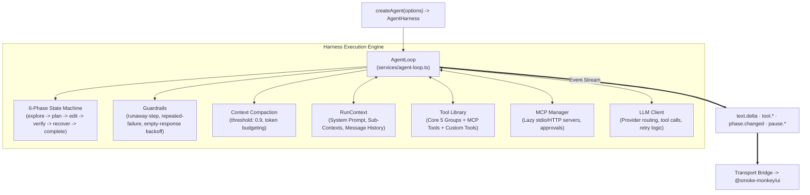

# 01. Architecture & Overview

> ⭐️ **Love Smoke Monkey Harness?** Please support the project with a star on [GitHub](https://github.com/RajdeepDevelopment/smoke-monkey-harness)!
> 🌐 **Interactive Simulator:** Test the agent loop and stream live at [smoke-monkey-harness.vercel.app](https://smoke-monkey-harness.vercel.app/)

---


Smoke Monkey Harness is an embeddable, framework-agnostic TypeScript runtime for building autonomous looping AI agents, code editors, and developer tools.

Unlike monolithic agent frameworks that bundle bloated abstractions and opaque prompts, Smoke Monkey separates the **autonomous execution loop**, the **human-in-the-loop permission model**, and the **frontend presentation layer** into three modular, high-performance packages.

---

## The 3 Pillars of Smoke Monkey

The Smoke Monkey ecosystem is structured around three dedicated libraries that can be used together or independently:

```
┌──────────────────────────────────────────────────────────────────────────────────┐
│                             SMOKE MONKEY ECOSYSTEM                               │
├────────────────────────┬────────────────────────┬────────────────────────────────┤
│ 1. Frontend UI         │ 2. Backend Harness     │ 3. Model Context Protocol      │
│ @smoke-monkey/ui       │ @smoke-monkey/harness  │ @smoke-monkey/mcp              │
├────────────────────────┼────────────────────────┼────────────────────────────────┤
│ • React chat interface │ • 6-phase state machine│ • 22 built-in MCP tools        │
│ • Streaming Markdown   │ • Automated loop guards│ • Stdio & HTTP SSE client      │
│ • Tool execution cards │ • Just-in-time skills  │ • Scaffolding & verification   │
│ • Interactive pauses   │ • Sub-context memory   │ • IDE / host integration       │
│ • 14 theme presets     │ • Zero runtime deps    │ • Claude Code, Cursor, Codex   │
└────────────────────────┴────────────────────────┴────────────────────────────────┘
```


### 1. `@smoke-monkey/ui` (The Frontend Interface)
A drop-in React chat interface designed specifically for AI agents. It features real-time streaming markdown, collapsible tool execution cards with runtime metrics, interactive Human-in-the-Loop confirmation modals, charts, Mermaid diagrams, and 14 built-in theme presets with an interactive HSL color builder.

### 2. `@smoke-monkey/harness` (The Autonomous Engine)
A zero-dependency TypeScript library that runs the agent loop. It implements a deterministic **6-Phase State Machine** (`explore → plan → edit → verify → recover → complete`), automated loop guards, token budget compaction, modular system sub-contexts, and five core tool groups.

### 3. `@smoke-monkey/mcp` (The Extensibility Protocol)
Provides 22 specialized tools that allow any external MCP client (such as Claude Code, Cursor, Codex, or Windsurf) to plan, scaffold, verify, and guide Smoke Monkey agent projects. Inside the harness, a native MCP client connects external databases, APIs, and custom services over `stdio` and `streamable-HTTP`.

---

## Core Engine Architecture

Inside `@smoke-monkey/harness`, execution is orchestrated across five decoupled service layers:



### Architectural Layers Explained

1. **`createAgent(options)`**: The public entry point exported from `@smoke-monkey/harness`. Configures workspace paths, LLM credentials, default subcontexts, and active tool groups.
2. **`AgentLoop`**: The execution driver. Dispatches model calls, parses structured tool invocations, evaluates phase transitions, enforces safety guardrails, and triggers compaction when token thresholds are reached.
3. **`RunContext`**: Assembles the immutable-per-turn context payload: base system instructions + active sub-contexts + active skills + token budget allocations.
4. **`ToolLibrary`**: The registry managing tool schemas, input validation, execution functions, and UI visual presentations.
5. **`MCPManager`**: Connects external MCP servers lazily, namespaces external tools as `<serverId>__<toolName>`, and enforces access permissions.
6. **`LLMClient`**: Handles unified provider communication (NVIDIA NIM reference, OpenAI, Anthropic, OpenRouter, Ollama) with automated retry and backoff.

---

## Lifecycle Event Contract

The harness communicates asynchronously with the outside world via an event-driven emitter. Every phase transition, token chunk, tool execution, and interactive pause emits a typed event:

```ts
// Subscribe to any lifecycle event
agent.on('text.delta', (e) => {
  process.stdout.write(e.data.delta); // Real-time token streaming
});

agent.on('tool.started', (e) => {
  console.log(`Starting tool: ${e.data.toolName} (callId: ${e.data.toolCallId})`);
});

agent.on('phase.changed', (e) => {
  console.log(`Phase changed from ${e.data.from} to ${e.data.to}`);
});

agent.on('permission.required', async (e) => {
  // Suspend the loop until the user approves or denies
  const allow = await askHumanConfirmation(e.data.toolName, e.data.input);
  await agent.resolvePermission(e.data.toolCallId, allow ? 'allow' : 'deny');
});
```

### Event Catalog Summary

| Category | Event Names | Description |
| :--- | :--- | :--- |
| **Run Lifecycle** | `run.started`, `run.completed`, `run.failed`, `run.warning`, `run.interrupted` | Master boundaries of an agent task execution. |
| **Turn & Streaming** | `text.delta`, `text.thought`, `text.end` | Live streaming tokens and chain-of-thought reasoning content. |
| **Tool Execution** | `tool.started`, `tool.output`, `tool.completed`, `tool.failed` | Tool invocation life cycle with execution duration and output artifacts. |
| **Loop State** | `phase.changed`, `compaction.started`, `compaction.completed`, `state.changed` | Autonomous state machine transitions and token window compaction. |
| **Interactive Pauses** | `permission.required`, `ask_user.required`, `mcp.approval_required` | Execution suspensions awaiting human input or permission resolution. |

---

## Design Principles

- **Zero Core Dependencies**: Core library depends solely on Node.js built-ins (`fs`, `path`, `child_process`, `crypto`).
- **Keys Never In Code**: API keys are read from environment variables or custom dynamic resolvers, supporting multi-tenant security.
- **Fail-Closed Safety**: Any mutating action (file edit, terminal command) defaults to requiring approval unless `autoApprove: true` is explicitly configured.
- **NVIDIA Reference Default**: Out-of-the-box configuration targets high-throughput NVIDIA NIM models (`nvidia/nemotron-3-super-120b-a12b`), with instant plug-and-play support for any OpenAI-compatible provider.
