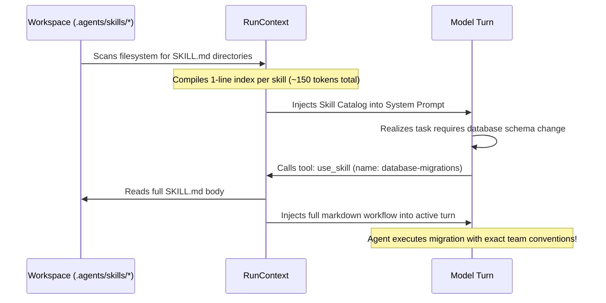

# 07. Just-in-Time Skills (SKILL.md Discovery)

> ⭐️ **Love Smoke Monkey Harness?** Please support the project with a star on [GitHub](https://github.com/RajdeepDevelopment/smoke-monkey-harness)!
> 🌐 **Interactive Simulator:** Test the agent loop and stream live at [smoke-monkey-harness.vercel.app](https://smoke-monkey-harness.vercel.app/)

---


Agent skills are modular instruction manuals that teach AI models specific engineering workflows, architectural patterns, team conventions, and debugging checklists.

Instead of stuffing dozens of lengthy instruction documents into the initial system prompt—which exhausts token budgets and causes attention degradation—Smoke Monkey Harness implements a **Two-Tier Just-in-Time (JIT) Skill Injection Pattern**.

---

## The Two-Tier JIT Injection Pattern



### Why This Saves Tokens & Improves Reasoning
1. **Tier 1 (Index Catalog)**: The model sees only skill names and a 1-sentence description in the system prompt (`~150 tokens`).
2. **Tier 2 (On-Demand Activation)**: When the model encounters a relevant task, it autonomously calls `use_skill`. Only the specific `SKILL.md` body is injected into context for that run.
3. **94% Context Savings**: You can maintain 50+ specialized skills in your repository without bloating prompt overhead.

---

## Multi-Root Skill Discovery

The harness automatically discovers skills from standard industry locations:

```ts
import { createAgent } from '@smoke-monkey/harness';

const agent = createAgent({
  workspacePath: process.cwd(),
  // Auto-scans standard directories, plus any custom paths
  skillsDir: [
    './.agents/skills',        // Smoke Monkey & Antigravity standard
    './.claude/skills',        // Claude Code standard
    './.opencode/skills',      // opencode standard
    '~/.agents/skills',        // Global user skills
    './internal-team-skills',  // Custom directory
  ],
});

// Inspect discovered skills
console.log(`Discovered ${agent.skills.count} skills:`);
for (const skill of agent.skills.all()) {
  console.log(`- ${skill.id}: ${skill.description}`);
}
```

---

## Creating a Custom Skill

A skill is simply a folder containing a `SKILL.md` file with YAML frontmatter:

```
my-project/
└── .agents/
    └── skills/
        └── database-migrations/
            ├── SKILL.md
            └── scripts/
                └── validate-migration.sh
```

### Example `SKILL.md` File

```markdown
---
name: database-migrations
description: Guidelines and checklists for creating safe PostgreSQL schema migrations without downtime.
category: backend
---

# PostgreSQL Safe Migration Playbook

When creating database migrations, you must follow these rules:

1. **Never rename columns directly**: Add a new column, backfill data, and deprecate the old column in separate releases.
2. **Always set lock timeouts**: Use `SET lock_timeout = '2s';` before altering table constraints.
3. **Add indexes concurrently**: Always use `CREATE INDEX CONCURRENTLY` to avoid table locks.

## Verification Checklist
- [ ] Run `npm run db:migrate` in the test environment.
- [ ] Confirm rollback script reverses all DDL changes cleanly.
```

---

## 25 Bundled Production Skills

`@smoke-monkey/harness` ships with 25 pre-built production skills categorized by engineering domain:

| Category | Representative Skills |
| :--- | :--- |
| **Backend** | `api-design`, `database-migrations`, `redis-caching`, `event-driven-architecture`, `auth-best-practices` |
| **Frontend** | `react-performance`, `state-management`, `tailwind-styling`, `accessibility-a11y` |
| **DevOps** | `docker-deployment`, `ci-cd-pipelines`, `kubernetes-manifests`, `terraform-standards` |
| **QA & Reliability** | `test-driven-development`, `e2e-playwright`, `security-audit`, `observability-and-instrumentation` |

You can browse and load these skills dynamically using the MCP server tools `harness_skills_by_category` and `harness_skill_content`.

---

## Next Steps

- Manage modular prompt blocks with subcontexts: [08. Sub-Contexts](08-subcontexts.md)
- Implement security validation hooks: [09. Lifecycle Hooks](09-hooks-and-errors.md)
- Test streaming UI components: [10. React UI Components](10-ui-components.md)
