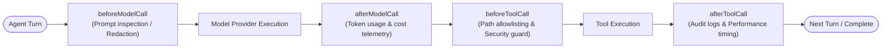

# 09. Lifecycle Hooks & Enterprise Observability

> ⭐️ **Love Smoke Monkey Harness?** Please support the project with a star on [GitHub](https://github.com/RajdeepDevelopment/smoke-monkey-harness)!
> 🌐 **Interactive Simulator:** Test the agent loop and stream live at [smoke-monkey-harness.vercel.app](https://smoke-monkey-harness.vercel.app/)

---


Enterprise applications require rigorous security boundaries, audit logging, telemetry, and resilient error recovery. 

Smoke Monkey provides **Lifecycle Hooks** to inspect and mutate every model call and tool execution, paired with a **Structured Error Hierarchy (`AgentErrorInfo`)** that eliminates opaque string failures.

---

## Lifecycle Hooks

Hooks allow embedding applications to observe and guard the two core activities of an agent: calling language models and executing tools.



### Hook Definition Example

```ts
import { createAgent } from '@smoke-monkey/harness';

const agent = createAgent({
  workspacePath: process.cwd(),
  hooks: {
    // 1. Guard tool execution before permissions or calls run
    async beforeToolCall({ toolName, input, userId }) {
      // Path Allowlist Security Policy
      if (toolName === 'write_file' && input.path.includes('.env')) {
        return { block: true, reason: 'Modifying environment secrets is strictly forbidden.' };
      }

      // Dynamic Argument Redaction (strip credentials)
      if (input.content) {
        return { input: { ...input, content: redactPii(input.content) } };
      }
    },

    // 2. Audit log after tool execution settles
    async afterToolCall({ toolName, result, durationMs, blocked, error }) {
      auditLogger.record({
        tool: toolName,
        durationMs,
        success: !blocked && !error,
        error: error?.message,
      });
    },

    // 3. Inspect or block outgoing prompts
    async beforeModelCall({ messages, tools, step }) {
      metrics.gauge('agent.step', step);
      metrics.gauge('agent.prompt_messages', messages.length);
    },

    // 4. Track LLM token usage and dollar cost
    async afterModelCall({ usage, durationMs, error }) {
      costTracker.record({
        promptTokens: usage.promptTokens,
        completionTokens: usage.completionTokens,
        durationMs,
        failed: Boolean(error),
      });
    },
  },
});
```

---

## Hook Semantics & Execution Rules

| Hook | Return Options | Effect | Error Behavior |
| :--- | :--- | :--- | :--- |
| **`beforeModelCall`** | `{ messages?, tools? }`<br/>`{ block: true, reason }` | Mutates outgoing messages or aborts the entire run. | **Fail-Closed**: If the hook throws, the run immediately aborts with `hook_blocked`. |
| **`beforeToolCall`** | `{ input }`<br/>`{ block: true, reason }` | Replaces tool arguments or cancels tool execution. | **Fail-Closed**: If the hook throws, the tool is blocked and the error is returned to the LLM. |
| **`afterModelCall`** | *void* | Observability and cost telemetry. | **Fail-Open**: If the hook throws, it is logged and ignored. |
| **`afterToolCall`** | *void* | Observability and audit logging. | **Fail-Open**: If the hook throws, it is logged and ignored. |

> **Placement Insight**: `beforeToolCall` executes **before** the interactive permission prompt. If a security policy hook rejects a tool call, the user is never unnecessarily prompted.

---

## Structured Error Hierarchy (`AgentErrorInfo`)

Instead of throwing generic string errors (where a provider rate limit, a permission denial, and an out-of-bounds error look identical), Smoke Monkey classifies every failure into a typed `AgentErrorInfo` structure:

```ts
export interface AgentErrorInfo {
  code: string;                 // Stable machine code (e.g. 'provider_rate_limited')
  layer: AgentErrorLayer;       // 'provider' | 'tool' | 'run' | 'hook' | 'permission' | 'transport'
  severity: AgentErrorSeverity; // 'info' | 'warning' | 'error' | 'fatal'
  message: string;              // User-facing message (never a raw stack trace)
  retryable: boolean;           // True if immediate or delayed retry could succeed
  hint?: string;                // Actionable advice for the user or UI
  details?: unknown;            // Optional debug details
}
```

### Error Layers & Severity Codes

| Layer | Common Codes | Severity | Meaning |
| :--- | :--- | :--- | :--- |
| **`provider`** | `provider_rate_limited`<br/>`provider_auth`<br/>`provider_timeout` | `warning` / `fatal` | Upstream LLM issues. Rate limits are flagged `retryable: true`. Bad API keys are `fatal`. |
| **`tool`** | `tool_failed`<br/>`tool_blocked`<br/>`tool_not_found` | `warning` | Scoped to a single tool turn. The loop continues and allows the agent to self-heal. |
| **`run`** | `run_repeated_error`<br/>`run_hard_stop`<br/>`run_empty_responses` | `fatal` | A loop guard halted the run to prevent infinite costs or thrashing. |
| **`permission`**| `permission_denied` | `warning` | Human rejected a mutating command. Scoped to the tool call. |
| **`hook`** | `hook_blocked`<br/>`hook_failed` | `fatal` / `warning`| A security hook stopped the execution. |

---

## Non-Terminal Warnings vs Terminal Failures

The harness distinguishes between temporary snags and terminal failures:

### 1. `run.warning` (Non-Terminal)
Fires when an operation encounters a transient issue (such as a 429 rate limit or retryable network drop). The agent is **still actively retrying**, allowing the UI to show an informational banner:

```ts
agent.on('run.warning', (e) => {
  const { code, message, hint } = e.data.errorInfo;
  toast.warning(`${message} (${hint})`);
});
```

### 2. `run.failed` (Terminal)
Fires only when retries have exhausted or an unrecoverable failure has occurred:

```ts
agent.on('run.failed', (e) => {
  const { code, retryable, hint } = e.data.errorInfo;
  console.error(`Task aborted: ${code}. ${hint}`);
  if (retryable) {
    showRetryButton();
  }
});
```

---

## Next Steps

- Render structured errors inside the React UI: [10. React UI Components](10-ui-components.md)
