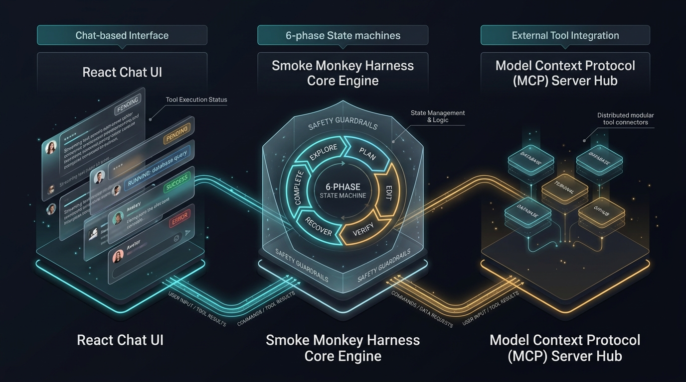

# Smoke Monkey Harness — Documentation Hub

  
  
  
  

Welcome to the **Smoke Monkey Harness** documentation center. Smoke Monkey is an embeddable, framework-agnostic TypeScript runtime for building autonomous looping AI agents, code editors, and developer tools with **zero runtime dependencies**.

---

## Core Guides

| Guide | Description |
| :--- | :--- |
| [**Architecture & System Design**](architecture.md) | High-level system architecture, service layers, and event streaming design. |
| [**Getting Started & Quickstart**](getting-started.md) | Multi-provider configuration (NVIDIA, OpenAI, Anthropic, Ollama) and first 20-line agent script. |
| [**Tool System & Registry**](tools.md) | 24 built-in tools across 5 groups, tool definition schema, and custom tool creation. |
| [**API Reference**](api.md) | Exhaustive TypeScript API reference, lifecycle hooks (`beforeModelCall`, `beforeToolCall`), and error handling hierarchy. |
| [**Model Context Protocol (MCP)**](mcp.md) | Stdio and HTTP SSE integration, tool namespacing, and bundled MCP development tools. |
| [**LLM Providers Matrix**](providers.md) | Provider routing, dynamic API key resolvers, and local model inference setup. |
| [**Contributing Guide**](contributing.md) | How to build, test, and contribute to Smoke Monkey. |

---

## Comprehensive 10-Chapter Guide (`docs/site/`)

For an in-depth, production-ready curriculum, explore the 10-chapter documentation suite:

| Chapter | Title | Focus Area |
| :---: | :--- | :--- |
| **01** | [**Architecture & Overview**](site/01-overview.md) | The 3 Pillars (`@smoke-monkey/ui`, `@smoke-monkey/harness`, `@smoke-monkey/mcp`), engine layers. |
| **02** | [**Quickstart & Providers**](site/02-getting-started.md) | Multi-provider setup, streaming tokens, dynamic auth resolvers. |
| **03** | [**The 6-Phase Agent Loop**](site/03-agent-loop.md) | Deterministic state machine (`explore → plan → edit → verify → recover → complete`), guards & compaction. |
| **04** | [**Tool System & Registry**](site/04-tools.md) | File, terminal, search, git, and agent tool groups. Custom tool creation. |
| **05** | [**Permissions & The 3 Pauses**](site/05-permissions.md) | Safe human-in-the-loop approvals, `permission.required`, and denial recovery. |
| **06** | [**Model Context Protocol (MCP)**](site/06-mcp.md) | Stdio & HTTP SSE client, tool namespacing, 22 built-in MCP tools. |
| **07** | [**Just-in-Time Skills**](site/07-skills.md) | JIT skill injection (94% token savings) and 25 bundled engineering skills. |
| **08** | [**Sub-Contexts & Memory**](site/08-subcontexts.md) | Modular prompt segments, runtime switching, and session persistence. |
| **09** | [**Lifecycle Hooks & Errors**](site/09-hooks-and-errors.md) | Intercepting execution, fail-closed authz, and `AgentErrorInfo` classification. |
| **10** | [**Drop-In React Chat UI**](site/10-ui-components.md) | `@smoke-monkey/ui` component anatomy, 14 theme presets, and streaming transport. |

### [🌟 Star Smoke Monkey Harness on GitHub](https://github.com/RajdeepDevelopment/smoke-monkey-harness)

