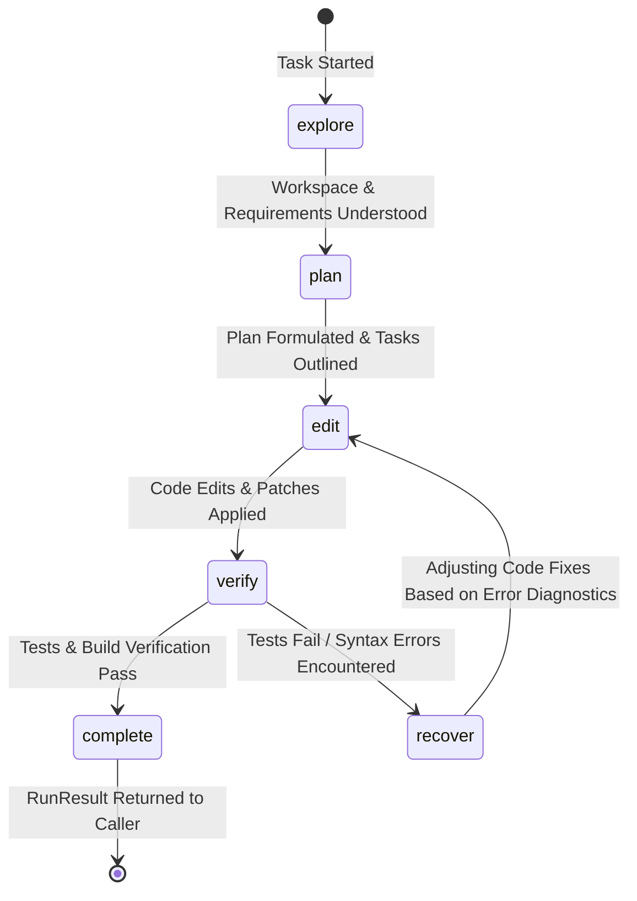

# 03. The 6-Phase Agent Loop & Guardrails

> ⭐️ **Love Smoke Monkey Harness?** Please support the project with a star on [GitHub](https://github.com/RajdeepDevelopment/smoke-monkey-harness)!
> 🌐 **Interactive Simulator:** Test the agent loop and stream live at [smoke-monkey-harness.vercel.app](https://smoke-monkey-harness.vercel.app/)

---


Unconstrained AI agents suffer from common failure modes: infinite loops, goal drift, repeated errors, and token exhaustion. 

Smoke Monkey Harness solves these challenges by bounding agent execution inside a deterministic **6-Phase State Machine** backed by automatic **run guards** and **context compaction**.

---

## The 6-Phase State Machine

Every task run transitions through six distinct execution phases:



### Detailed Phase Breakdown

| Phase | Description | Permitted Tool Types | Transition Condition |
| :--- | :--- | :--- | :--- |
| **`explore`** | Investigating repo layout, reading files, searching codebases. | Read-only (`read_file`, `glob`, `grep`, `git_status`) | Shifts to `plan` once key files and architecture are identified. |
| **`plan`** | Outlining implementation strategy, decomposing sub-tasks. | Planning tools (`todo_write`, `context_manage`) | Shifts to `edit` once actionable steps are registered. |
| **`edit`** | Writing code, creating files, replacing line ranges, applying patches. | Mutating tools (`write_file`, `edit_file`, `apply_patch`) | Shifts to `verify` once planned edits are executed. |
| **`verify`** | Running compilers, test suites, linters, and typecheckers. | Execution tools (`run_command`, `run_tests`) | Passes to `complete` if tests pass; demotes to `recover` if failed. |
| **`recover`** | Self-healing: inspecting build/test errors and formulating corrections. | Analysis tools (`read_file`, `git_diff`) | Shifts back to `edit` to apply corrected logic. |
| **`complete`** | Final verification, clean-up, and synthesizing the user response. | Read-only | Execution completes; `RunResult` returned. |

---

## Automatic Demotion & Self-Healing

The critical innovation of the Smoke Monkey phase engine is **automatic failure demotion**:

When the agent is in the `verify` phase and executes a test or build tool that fails (returns exit code != 0 or `isError: true`), the engine **automatically demotes the phase to `recover`**.

This prevents the LLM from falsely assuming a task succeeded and forces a structured reflection cycle before returning to `edit`.

```ts
agent.on('phase.changed', (e) => {
  console.log(`[Phase Change] ${e.data.from} ➔ ${e.data.to}`);
  if (e.data.to === 'recover') {
    console.warn('⚠️ Tests failed! Agent has entered self-healing recovery mode.');
  }
});
```

---

## Built-In Loop Guards

The harness automatically activates protective guardrails on every step:

```
┌────────────────────────────────────────────────────────────────────────┐
│                        AUTOMATIC LOOP GUARDS                           │
├─────────────────────────┬──────────────────────────────────────────────┤
│ Guard                   │ Trigger & Behavior                           │
├─────────────────────────┼──────────────────────────────────────────────┤
│ 1. Runaway Step Guard   │ Aborts if step count exceeds `MAX_STEPS`     │
│                         │ (default: 1000; configurable per run).       │
│ 2. Repeated Error Guard │ Detects identical failures 3 times in a row; │
│                         │ halts with `run_repeated_error`.             │
│ 3. Identical Output     │ Detects circular generation of same text/tool│
│                         │ call; forces a prompt correction injection.  │
│ 4. Empty Response Guard │ Automatically backs off with exponential     │
│                         │ delay if provider returns empty tokens.      │
│ 5. Search Loop Breaker  │ Prevents recursive `glob`/`grep` cycling     │
│                         │ by capping consecutive search operations.    │
└─────────────────────────┴──────────────────────────────────────────────┘
```

---

## Context Compaction & Token Budgeting

Long coding sessions can easily exceed the LLM's context window. Smoke Monkey features an intelligent, multi-stage compaction algorithm:

1. **Context Token Budget**: Default budget is set to **164,000 tokens** (`CONTEXT_TOKEN_BUDGET`).
2. **Compaction Threshold**: When cumulative context reaches **90%** of capacity (`COMPACTION_THRESHOLD = 0.9`):
   - The harness triggers `compaction.started`.
   - Older intermediate turns, large tool outputs, and historical exploration logs are compressed into a coherent summary.
   - The most recent messages (`KEEP_RECENT_MESSAGES`) are retained verbatim to preserve conversational momentum.
   - The harness emits `compaction.completed` with the new token count.

```ts
// Monitor compaction in your application
agent.on('compaction.started', (e) => {
  console.log('Compacting conversation memory to stay within token limits...');
});

agent.on('compaction.completed', (e) => {
  console.log(`Compacted from ${e.data.beforeTokens} to ${e.data.afterTokens} tokens.`);
});
```

---

## Configuring Run Options

You can customize loop bounds, token limits, and phase rules per task execution:

```ts
const result = await agent.run('Refactor the user authentication pipeline', {
  maxSteps: 50,                  // Override runaway step threshold
  temperature: 0.2,              // Strict deterministic generation
  signal: abortController.signal,// Support manual cancellation
});
```

---

## Next Steps

- Explore the built-in tool library: [04. Tool System](04-tools.md)
- Learn how safety permissions guard against unintended edits: [05. Permissions](05-permissions.md)
- Organize domain-specific guidance using subcontexts: [08. Sub-Contexts](08-subcontexts.md)
